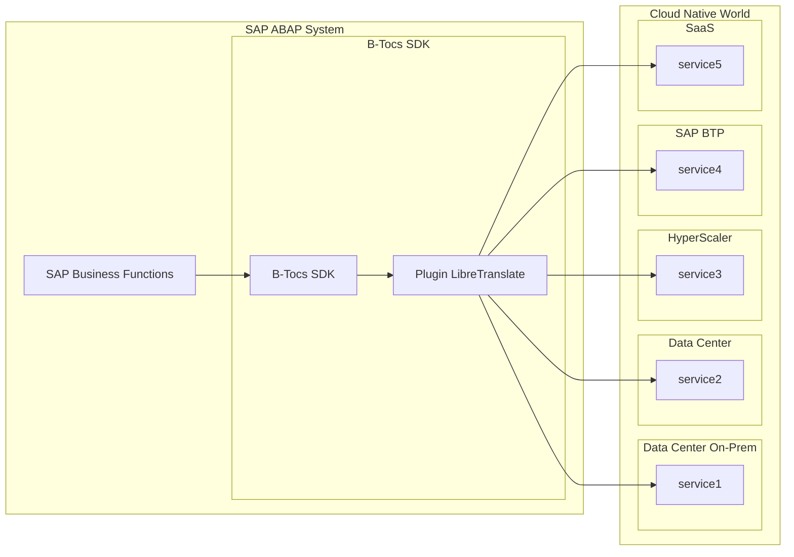

# B-Tocs ABAP Addon LibreTranslate

## Summary

This plugin is based on the [B-Tocs ABAP SDK](https://github.com/b-tocs/abap_btocs_core) and enables the SAP ABAP Server to use the translation service [LibreTranslate](https://libretranslate.com/).

The plugin is free at your own risk. 

# Installation & Configuration

The installed [B-Tocs ABAP SDK](https://github.com/b-tocs/abap_btocs_core) is required. Install the plugin it with [abapGit](https://abapgit.org). 

## Architecture

